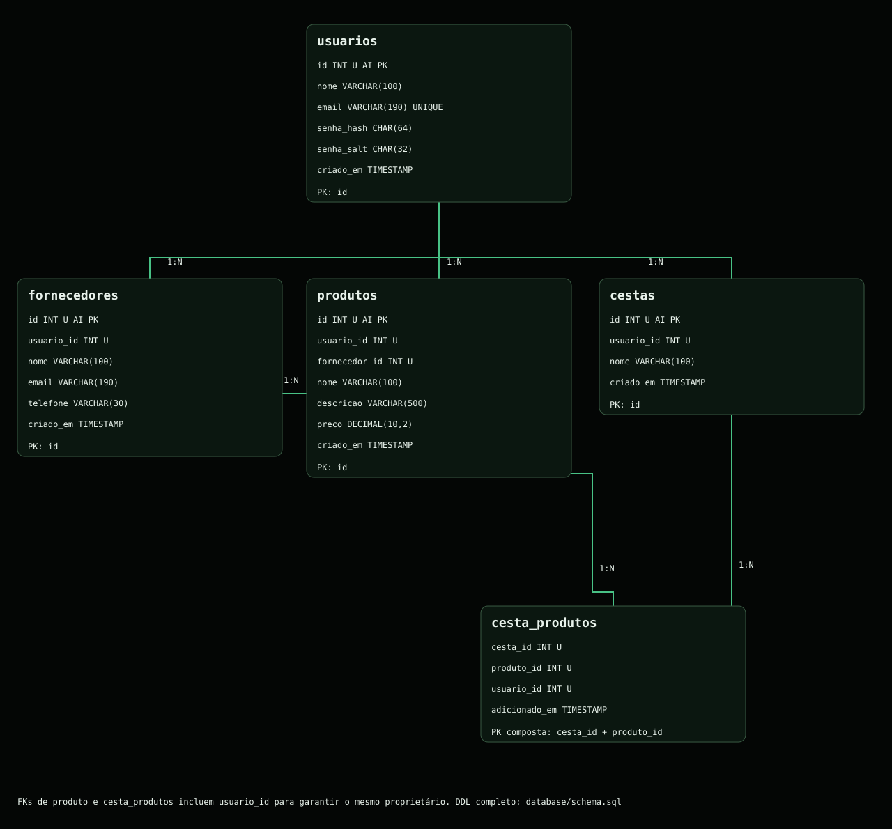
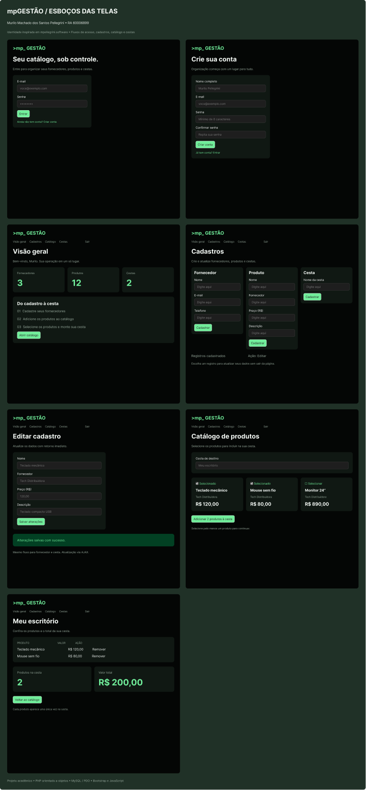

# mpGESTÃO — Mini Sistema de Gestão de Produtos

**Murilo Machado dos Santos Pellegrini — RA 60006899**

Sistema de gestão de fornecedores, produtos e cestas desenvolvido em PHP orientado a objetos, MySQL/PDO, Bootstrap 5.3.3 e JavaScript puro.

## Funcionalidades

- Cadastro e autenticação de usuários por sessão.
- Temas claro e escuro, com preferência salva no navegador.
- Cadastro de fornecedores, produtos e cestas no banco de dados.
- Área independente de edição dos três cadastros via `fetch`/AJAX.
- Catálogo com checkboxes e validação de seleção no cliente e no servidor.
- Cestas persistentes por usuário, uma unidade de cada produto, total monetário e número de produtos.
- Remoção de itens da cesta; isolamento dos registros por proprietário.
- Criação automática do banco e tabelas por instalador CLI idempotente.

## Instalação

Clone o repositório ou baixe e extraia o ZIP:

```sh
git clone https://github.com/Pellegrini196/mpgestao.git
cd mpgestao
```

O acesso ao repositório exige uma conta autorizada, pois ele é privado.

### Iniciador no Windows

Na pasta do projeto, dê dois cliques em [Iniciar.cmd](Iniciar.cmd). O iniciador procura PHP no PATH ou XAMPP em `C:\xampp` / `D:\xampp`. Quando necessário, inicia o MySQL do XAMPP, prepara as tabelas, abre o servidor e o navegador em **http://127.0.0.1:8000**. Sem PHP, tenta o Docker Compose, caso o Docker Desktop esteja instalado e aberto.

O iniciador não instala dependências nem altera a política de execução do Windows. PHP 8.2+ com PDO MySQL e um servidor MySQL ou MariaDB compatível são necessários; Docker Compose é a alternativa. Para banco personalizado, configure `config/local.php`. Feche a janela do servidor PHP para encerrar; com Docker, use `docker compose down`.

Para apenas conferir o visual sem instalar nada, abra [PREVIA.html](PREVIA.html). É uma captura HTML da aplicação, com dados fictícios e alternância de tema; cadastros e login funcionam somente no servidor.

## Executar manualmente no Windows / VS Code

Requisitos: PHP 8.2+ com PDO MySQL, MySQL 8.0.16+ (ou MariaDB 10.11+) e Git. Bootstrap está incluído localmente; o site não depende de CDN.

1. Abra a pasta do projeto no VS Code.
2. Inicie o MySQL. Em XAMPP, ative o serviço MySQL e use `C:\xampp\php\php.exe` se `php` não estiver no PATH.
3. Copie `config/local.example.php` para `config/local.php` e ajuste host, porta, usuário e senha do banco.
4. No terminal da pasta do projeto:

```powershell
php bin/install.php
php -S 127.0.0.1:8000 -t public
```

5. Abra **http://127.0.0.1:8000**, escolha **Cadastre-se** e crie sua conta.
6. Em **Cadastros**, crie primeiro um fornecedor; depois um produto vinculado e uma cesta.
7. Em **Catálogo**, selecione os produtos e a cesta de destino. Confira o total em **Minhas cestas**.
8. Em **Editar registros**, altere fornecedor, produto ou cesta e salve sem recarregar a página.

O usuário do instalador precisa de permissão para criar banco/tabelas. Não publique `config/local.php`. O servidor embutido do PHP destina-se ao desenvolvimento; a raiz HTTP deve ser somente `public/`.

## Executar com Docker Compose

```sh
docker compose up --build -d
```

Acesse http://127.0.0.1:8000. O serviço aguarda a saúde do MySQL e executa o instalador automaticamente. As credenciais no Compose são exclusivamente para desenvolvimento local. O volume `mysql_data` preserva os dados.

## Estrutura e orientação a objetos

```text
app/          Entidades, autenticação, validação, banco e repositório PDO
bin/          Instalador do banco
config/       Configuração por ambiente ou arquivo local ignorado pelo Git
database/     Modelo SQL com chaves e restrições
docs/         Planejamento, DER e esboços
public/       Única pasta exposta pelo servidor HTTP
scripts/      Verificação dos requisitos do iniciador local
tests/        Testes de domínio, integração com banco e fluxo HTTP
```

`Usuario` possui cestas. `Produto` referencia um objeto `Fornecedor`. `Cesta` mantém objetos `Produto`, elimina duplicatas e calcula quantidade e total em centavos inteiros. `Repository` hidrata essas relações a partir do PDO e restringe operações ao usuário autenticado.

## Modelo de dados



O arquivo [schema.sql](database/schema.sql) contém todos os campos, índices, chaves estrangeiras e restrições. A chave primária `(cesta_id, produto_id)` impede duplicação de produtos. As chaves estrangeiras compostas com `usuario_id` impedem relações entre registros de proprietários diferentes. Importável no MySQL Workbench via **File → Import → Reverse Engineer MySQL Create Script**.

## Esboços das telas



[Abrir arquivo editável no Figma](https://www.figma.com/design/mtPqZOrZAIF2Trn25V201X)

As sete telas documentam os fluxos de login, cadastro de conta, visão geral, cadastros, edição, catálogo e cesta. O estudo inicial também está disponível em [esbocos.svg](docs/esbocos.svg).

## Autenticação

A implementação em [app/Auth.php](app/Auth.php) utiliza **SHA-256 com salt individual**. No cadastro, `random_bytes(16)` gera 16 bytes aleatórios, convertidos por `bin2hex` em uma string de 32 caracteres. Essa string é concatenada à senha antes do cálculo do hash:

```php
$salt = bin2hex(random_bytes(16));
$hash = hash('sha256', $salt . $password);
```

O banco armazena o salt em `senha_salt` e o hash hexadecimal de 64 caracteres em `senha_hash`. A senha não é armazenada em texto puro. No login, o sistema refaz o cálculo com o salt da conta e compara o resultado com `hash_equals`.

Esse mecanismo integra a implementação acadêmica. SHA-256 é uma função de hash de uso geral; adicionar salt não a transforma em um algoritmo específico de armazenamento de senhas.

As operações de alteração usam token CSRF. O acesso ao banco utiliza consultas preparadas, as saídas HTML são escapadas e a sessão é regenerada após o login. Os cookies de sessão usam HttpOnly e SameSite.

## Escopo

Cada produto corresponde a uma unidade por cesta. O total considera o preço atual do cadastro. É possível remover produtos de uma cesta; a exclusão de fornecedores, produtos e cestas não foi implementada. Estoque, pagamento e fechamento de pedido estão fora do escopo.

## Verificação

```sh
php tests/domain.php
node tests/theme.cjs
# Use um banco exclusivo cujo nome termine em _test:
DB_NAME=mpgestao_test php tests/integration.php
```

No PowerShell, use `$env:DB_NAME="mpgestao_test"` antes do segundo comando. Se existir `config/local.php`, esse arquivo prevalece sobre as variáveis; ajuste-o para o banco de testes. Consulte [TESTES.md](docs/TESTES.md) para os resultados efetivamente executados.

## Referências e dependências

- [PHP PDO](https://www.php.net/manual/pt_BR/book.pdo.php)
- [Bootstrap 5.3](https://getbootstrap.com/docs/5.3/getting-started/introduction/) — licença MIT, preservada no cabeçalho do CSS.
- Inter — fonte incluída localmente sob a [SIL Open Font License](public/assets/fonts/OFL.txt).
- [Planejamento](docs/PLANEJAMENTO.md)
